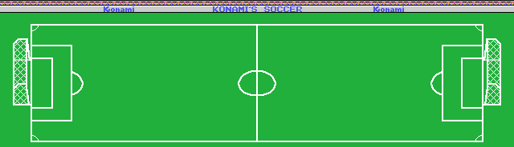
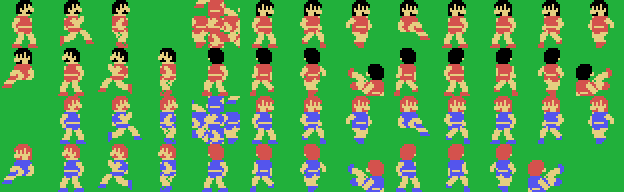
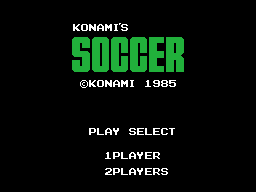

# El juego

*Konami's Soccer* salió en 1985 para MSX, en cartucho de 32 KB con el número
de catálogo **RC-732**. Un partido de fútbol de seis contra seis más los
porteros, con reloj, prórroga por penaltis y editor de nombres para los dos
equipos.

## El campo no cabe en la pantalla

Un MSX1 enseña 32 casillas de ancho. El campo de este juego mide **80**, y
vive descomprimido en la RAM, en `0xE600`: 80 columnas por 23 filas, 1.840
casillas. La pantalla es una ventana de 32 columnas que corre por él, y por
dónde va lo dice `(0xE2C1)`, que arranca en la 24.

La medida no está escrita en ninguna parte del cartucho: la fija la aritmética
de `vuelca_el_campo` (`0x5DD6`), que saca 32 casillas con `outi` y **salta 48**
antes de la fila siguiente. 32 más 48 son 80.

En píxeles el campo mide 640 de ancho. Las bandas están en las alturas `0x1D`
y `0xB3` —150 píxeles entre ellas—, los fondos en el píxel 30 y el 601, los
palos ocupan `0x49`-`0x4A` y `0x81`-`0x82` —dos píxeles de grosor cada uno— y
entre ellos quedan **54 píxeles de portería**. La red está en el píxel `0x12`
y en el `0x267`: ahí se clava la pelota del gol, con su sonido propio.

## Los jugadores

Los doce jugadores de campo no se dibujan igual. Un bando se **estampa sobre
el mapa**, como parches de tres por tres casillas; el otro sale con **cinco
sprites por jugador**. En [Hallazgos](HALLAZGOS.html) está el porqué y el
orden exacto del cuadro.

Las poses salen de un árbol de dos niveles: `(ix+0x0C)` elige el grupo y
`(ix+0x0D)` el dibujo dentro del grupo. Son **26 poses para un bando y 25 para
el otro**, y arriba están todas.

Los dos porteros no son fichas como los demás: son dos parches con su propia
tabla y su propio hueco de fondo, que se estampan detrás de los seis.

## Las reglas que el cartucho lleva dentro

- **El fuera de juego se pita.** Con dos jugadores, siempre; contra la
  máquina, sólo del **nivel 3 en adelante**.
- **El robo depende del ángulo.** Si el que entra y el que lleva la pelota no
  van encarados, en vez de robo hay choque: los dos al suelo.
- **El larguero devuelve media velocidad**, y el poste sólo cambia el signo
  del desvío, con su sonido.
- **Empate al final: penaltis**, y su tanda tiene sus propios pasos, su propio
  portero y su propia puntería.

## Los cinco niveles

No hay una inteligencia distinta por nivel: hay **bandas muertas y permisos**.

| nivel | 1 | 2 | 3 | 4 | 5 |
|---|---|---|---|---|---|
| altura a la que el portero deja de reaccionar | 32 | **44** | 24 | 20 | 16 |
| cuadros que tarda en reaccionar la máquina | 16 | 14 | 12 | 10 | 8 |
| paso de la máquina con la pelota | 0x0E0 | 0x0F0 | **0x100** | 0x110 | 0x120 |
| paso de la máquina suelto | 0x130 | 0x140 | **0x150** | 0x160 | 0x170 |

El bando del humano reacciona **siempre en 8 cuadros**, así que la máquina no
llega a ganarle nunca: en el nivel 5 lo iguala. Y el **nivel 3 es el nivel
justo**: es donde el paso de la máquina vale exactamente lo mismo que el del
humano —`0x100` con la pelota y `0x150` suelto, los dos valores fijos que
`0x5721` le da al bando 0—. Por debajo del 3 la máquina anda más despacio que
tú; por encima, más deprisa.

Lo raro de la tabla es el portero del **nivel 2**, que con 44 es el más pasivo
de los cinco, más que el del nivel 1. Del 3 al 5 la progresión baja limpia.

Y hay cuatro cosas que la máquina sólo hace a partir de cierto nivel:

| lo que hace | desde el nivel |
|---|---|
| apuntar a donde va a estar el objetivo, y no a donde está (`0x9260`) | 4 |
| la finta en diagonal (`0xB12C`) | 3 |
| despejar tras un tiro (`0xB19D`) | 4 |
| corregir a la esquina contraria a la que va el portero (`0xB266`) | 4 |
| pitar el fuera de juego (`0xB671`) | 3 |

En el nivel 1, además, la mitad de las pasadas ni siquiera esquiva
(`0xB0D4`).

## El menú

Se eligen uno o dos jugadores, el color de camiseta de cada equipo —ocho
juegos de tres tonos, y el menú no deja que coincidan—, el nivel y la
duración de la parte. Los nombres de los equipos se editan letra a letra, y de
fábrica son **EAGLES** y **STONES**.
