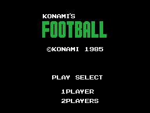
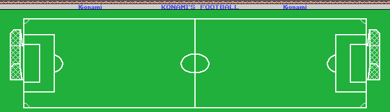

# La otra compilación: Konami's Football

El mismo cartucho salió también como **Konami's Football**. Mismo año, mismo
tamaño y **el mismo número de catálogo, RC-732**. La pregunta es qué cambia, y
la respuesta se puede dar con un número: **una instrucción de 9.755**.

    Konami's Soccer      b9536809a1784afb2e49a43d80ba9c6c8c15cd31ecbd6c284e9bf62c6927dcd4
    Konami's Football    1fee5ce4d4d5f48a92849eb7bed7ebb653f7e773fd4467824c27f54204b0fe7f

## El diff byte a byte no sirve para nada

Comparados byte a byte, los dos cartuchos se diferencian en **28.586 bytes de
32.768**, o sea el 87,2 %. Ese número no dice nada: la segunda compilación está
**corrida**. El logotipo de Football ocupa menos que el de Soccer, todo lo que
va detrás se desplaza, y a partir de ahí cada `call` apunta a otro sitio aunque
llame exactamente a lo mismo.

Alineando las dos ROM, el desplazamiento sólo cambia **cuatro veces** en 32 KB:

| desde | hasta | desplazamiento |
|---|---|---|
| `0x4000` | `0x4D1C` | 0 |
| `0x4E1D` | `0x6DBC` | −46 |
| `0x6DDE` | `0x73C9` | −44 |
| `0x73CA` | `0x8599` | −40 |
| `0x85A9` | `0xBFF3` | −38 |

O sea: Football arranca 46 bytes más corto y recupera 2, 4 y 2 en tres puntos.
Y `0xBFF3` vuelve a coincidir porque la marca de Konami va pegada al final.

## Instrucción a instruccción

Con ese mapa se pueden comparar las dos compilaciones como hay que compararlas:
desensamblando las dos y traduciendo las direcciones de una al espacio de la
otra, de modo que un `call 04ef7h` de Football y un `call 04f25h` de Soccer se
vean iguales, que es lo que son. Lo hace `tools/coteja_builds.py`:

    python3 tools/coteja_builds.py soccer.rom football.rom \
            work/soccer.trace.json 0x4000

    9755 instrucciones cotejadas, 1 distintas (0.01 %)
      0x4cdb  A: ld c,005h    B(0x4cdb): ld c,004h

**Esa es toda la diferencia de código entre los dos cartuchos.** Y está en la
pantalla de título: `0x4CDB` carga en C el número de filas del rótulo grande,
que `0x4CDD` recorre estampando catorce patrones consecutivos por fila. Soccer
pinta **cinco filas** de tiles y Football **cuatro**.

## Y en los datos, cuatro cosas

De los 125 bloques de datos declarados, **97 son idénticos byte a byte**. De los
28 restantes, veinticuatro son tablas de punteros —las de subescenas, las de
parches, las de sonidos— que cambian sólo porque las direcciones a las que
apuntan se han movido. Quedan cuatro cambios de verdad, y los cuatro son el
mismo cambio:

| bloque | qué es | qué cambia |
|---|---|---|
| `patrones_4d1c` | el logotipo grande del título | 262 de 280 bytes: es otro dibujo |
| `patrones_6d8d` | los tiles del campo | Football escribe **104 bytes de VRAM en vez de 96**: un tile más |
| `color_739b` | el color de esos tiles | 7 de 120 bytes |
| `mapa_del_campo` | las 1.840 casillas del campo | **7 casillas**, todas en la fila 1, columnas 41 a 48 |

Esas siete casillas son **la valla publicitaria** que cruza el campo por arriba.

Compárese con [el de Soccer](EL-JUEGO.html): es el mismo campo, línea por
línea, y lo único que cambia es lo que pone la valla.

## Lo que NO cambia

- La cabecera de `0x4000` a `0x4025` es **idéntica byte a byte**: mismo "AB",
  mismo INIT en `0x4070` y la misma cabecera del Konami Game Master en `0x4010`
  con su `0x07` y su `0x32`.
- La **marca oculta de Konami** también: los trece bytes de `0xBFF3` son los
  mismos, `BA 85 B5 8A 00 98 00 9F 94 89 0A 32 AA`. El título en katakana que
  el cartucho lleva escondido dentro **sigue diciendo サッカー**, Soccer,
  aunque la etiqueta diga Football.
- Y el juego. Las cinco tablas de dificultad, la puntería, el fuera de juego,
  los parches de los jugadores, el sonido: los 97 bloques idénticos.

## Comprobado contra el emulador

El campo de Football de arriba está montado ejecutando en Python los pasos del
propio cartucho, y cotejado contra un volcado de VRAM de openMSX igual que el
de Soccer:

    COLOR 0    PATRONES 0    SPR PATR 0
    MAPA de 0xE600, 80x23:  2 de 1840   (los dos porteros)
    VENTANA de 23x32:      44 de 736    (42 son parches de jugador)

Las mismas cifras, exactamente, que las de Soccer.
